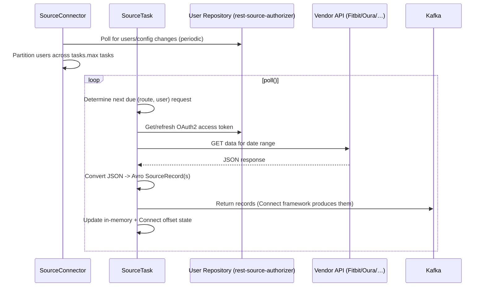

# Architecture

This document describes how RADAR-REST-Connector is put together, so that future contributors
(human or agent) can orient themselves quickly and add new device/API integrations consistently
with the existing patterns.

## What this repo is

A multi-module Gradle project providing Kafka Connect **source connectors** that poll third-party
REST APIs (wearable vendor APIs) on behalf of RADAR-base study participants and publish the
resulting data as Avro records on Kafka topics. It currently ships three concrete connectors —
**Fitbit**, **Oura**, and **Huawei Health Kit** — the latter two built on the "library + thin
Connect glue" pattern described below; Fitbit predates that pattern and uses the older, generic
`kafka-connect-rest-source` framework instead.

```
RADAR-REST-Connector/
├── kafka-connect-rest-source/     # Generic Kafka Connect REST-source framework (Java)
├── kafka-connect-fitbit-source/   # Fitbit connector (Java), oldest/original implementation
├── oura-library/                  # Oura domain logic: routes, converters, requests (Kotlin, no Kafka Connect deps)
├── kafka-connect-oura-source/     # Oura Kafka Connect glue (Java+Kotlin), wraps oura-library
├── huawei-library/                # Huawei domain logic: routes, converters, requests (Kotlin, no Kafka Connect deps)
├── kafka-connect-huawei-source/   # Huawei Kafka Connect glue (Java+Kotlin), wraps huawei-library
├── docker/                        # Docker Compose config templates, launch/ensure scripts, log4j
├── scripts/REDCAP-FITBIT-AUTH-AUTO/  # Standalone Python helper for REDCap-driven Fitbit auth
└── docker-compose.yml             # Full local Kafka stack + both connectors, for manual testing
```

Root Gradle config (`build.gradle.kts`, `settings.gradle.kts`, `gradle/libs.versions.toml`) uses
the `org.radarbase.radar-kotlin` / `radar-root-project` plugins (from `radar-commons`) for shared
build conventions (Kotlin/Java toolchain, Sentry, versioning). All dependency versions are
centralized in `gradle/libs.versions.toml` (a Gradle version catalog) — add new deps there, not
inline in module build files.

Avro **schemas are not defined in this repo**. They come from the external `radar-schemas-commons`
artifact (`org.radarbase:radar-schemas-commons`, versioned in the catalog), generated from the
[RADAR-Schemas](https://github.com/RADAR-base/RADAR-Schemas) repository. Adding a new data type
therefore requires a schema to exist there first (e.g. `org.radarcns.connector.oura.OuraDailyActivity`),
before this repo can build an Avro record for it.

## Two architectural generations

The repo contains two different design generations. Understand both before adding Huawei, and
prefer the **Oura pattern** for new integrations — it is the more recent, more testable design.

### 1. Generic `kafka-connect-rest-source` framework (used by Fitbit)

Located at `kafka-connect-rest-source/src/main/java/org/radarbase/connect/rest/`. Defines a small
set of interfaces meant to be generic across arbitrary REST APIs:

- `AbstractRestSourceConnector` — Kafka Connect `SourceConnector` base class. Loads
  `RestSourceConnectorConfig` from properties and hands out `RestSourceTask` as the task class.
- `RestSourceConnectorConfig` — `AbstractConfig` wrapper exposing the generic
  `rest.source.*` properties (base URL, poll interval, topic selector class, payload converter
  class, request generator class — all pluggable via `ConfigDef.Type.CLASS`).
- `RequestGenerator` (`request/`) — produces a `Stream` of `RestRequest`s to issue and knows when
  the next request is due (`getTimeOfNextRequest()`), driven by the Kafka Connect offset storage
  (`setOffsetStorageReader`).
- `RequestRoute` / `PollingRequestRoute` (`request/`) — one "route" = one logical polling
  endpoint/data type. Routes own their own per-user polling cadence, backoff, and offset state, and
  are notified of `requestSucceeded` / `requestEmpty` / `requestFailed`.
- `PayloadToSourceRecordConverter` (`converter/`) — turns a raw HTTP response body into one or more
  Kafka Connect `SourceRecord`s.
- `RestSourceTask` — the actual Kafka Connect `SourceTask`. Its `poll()` loop: sleep until the next
  request is due, iterate `requestGenerator.requests()`, execute the first request that yields
  records, return them.

This module is intentionally protocol-agnostic; it has no notion of "Fitbit" or OAuth. It's a
reasonable place to fix or extend genuinely generic REST-polling behavior (e.g. topic selection,
generic retry semantics), but new device integrations do **not** need to hook into it directly —
see the Oura pattern below.

### 2. Fitbit connector (`kafka-connect-fitbit-source`) — first concrete integration

Built directly on the generic framework above, entirely in Java:

- `FitbitSourceConnector extends AbstractRestSourceConnector` — schedules a periodic
  (`application.loop.interval.ms`) user-repository refresh; if the user set changes, requests task
  reconfiguration (`context.requestTaskReconfiguration()`). Divides users across `tasks.max` tasks
  by hashing `user.getVersionedId()`.
- `FitbitRequestGenerator extends RequestGeneratorRouter` — builds the list of enabled
  `RequestRoute`s (one per Fitbit data type: sleep, activity log, resting heart rate, and — if
  `fitbit.api.intraday=true` — steps, heart rate, HRV, breathing rate, skin temperature, calories,
  SpO2) and an OkHttp client per user with a `TokenAuthenticator` (auto-refreshes on HTTP 401).
- `route/Fitbit*Route` — one class per data type, extending `FitbitPollingRoute`, which implements
  a fairly elaborate polling algorithm: don't poll more than once per `pollInterval`; walk history
  back to `HISTORICAL_TIME_DAYS`; avoid re-reading the last `LOOKBACK_TIME` to tolerate
  late-arriving data from other devices; back off per-user on HTTP 429 (`TOP_OF_HOUR` or
  `ROLLING_WINDOW` cooldown strategy) and after `fitbit.request.max.forbidden` consecutive HTTP 403s.
- `converter/Fitbit*AvroConverter` — one class per data type, converts JSON to the corresponding
  Avro record from `radar-schemas-commons`.
- `user/UserRepository` (interface) + implementations:
  - `YamlUserRepository` — reads per-user YAML files from a directory (`docker/fitbit-user.yml.template`
    shows the format: id, projectId, userId, sourceId, startDate/endDate, externalUserId, OAuth2
    access/refresh tokens).
  - `ServiceUserRepository` (Kotlin) — talks to an external "rest-source-authorizer" webservice
    (typically fronted by ManagementPortal) for user lists and token refresh/storage, using
    OAuth2 client-credentials auth.
  - `firebase/FirebaseUserRepository` / `CovidCollabFirebaseUserRepository` — legacy
    Firestore-backed repository for a specific historical deployment.
- `request/TokenAuthenticator` — OkHttp `Authenticator` that refreshes the access token via the
  `UserRepository` on a 401 and retries the request.

### 3. Oura connector (`oura-library` + `kafka-connect-oura-source`) — newer pattern

This is the template to follow for a **new** vendor integration such as Huawei. It splits cleanly
into:

- **`oura-library`** (pure Kotlin, no Kafka Connect / OkHttp-Authenticator coupling to Connect
  internals) — all vendor-specific domain logic, independently unit-testable and in principle
  reusable outside Kafka Connect:
  - `user/User`, `user/UserRepository` — user model and repository interface (`get`, `stream`,
    `getAccessToken`); note `refreshAccessToken` lives on the connector-side implementation, not
    here, in current Oura code (asymmetry vs. Fitbit — be aware when implementing).
  - `route/Route` (interface) + `route/OuraRoute` (abstract base) + `route/Oura*Route` (one per
    data type: daily activity, readiness, sleep, SpO2, heart rate, personal info, sessions,
    workouts, tags, ring configuration, stress, VO2 max, resilience, cardiovascular age, enhanced
    tags, rest-mode periods, sleep-time recommendations, etc.) — each route knows its API sub-path
    and builds one or more `RestRequest`s covering a `[start, end)` window, chunked by
    `maxIntervalPerRequest`.
  - `route/OuraRouteFactory` — central list of all routes (used mainly by tests / defaults; the
    connector module actually builds its own filtered list based on config flags — see below).
  - `converter/OuraDataConverter` (→ `RecordConverter`) + `converter/Oura*Converter` — one per data
    type, parses the JSON response into `TopicData(topic, key, value, offset)` where `value` is a
    generated Avro `SpecificRecord` from `radar-schemas-commons` (e.g. `OuraDailyActivity`). This
    is the direct analogue of Fitbit's `Fitbit*AvroConverter`, but returns plain data objects
    instead of Kafka Connect `SourceRecord`s directly — the Connect-specific wrapping happens in
    the connector module.
  - `request/OuraRequestGenerator` — the polling brain: for each `(route, user)` pair, computes the
    offset to resume from (via `OuraOffsetManager`), decides whether to use a large "historical"
    chunk (`HISTORICAL_QUERY_RANGE` = 1 year, once `timeSinceStart > HISTORICAL_DATA_THRESHOLD` = 1
    year) or normal recent-data chunking, and interprets HTTP responses
    (`handleResponse`/`requestSuccessful`/`requestFailed`) into typed `OuraResult`/`OuraError`
    sealed hierarchies with per-(route,user) backoff bookkeeping (`routeNextRequest` map) for 429 /
    403 / 401 / 400 / 422 / 404 / other.
  - `request/OuraOffsetManager` (interface) — abstraction for reading/writing per-(route,user)
    offsets; the Kafka Connect implementation is `KafkaOffsetManager` in the connector module.
  - `offset/Offset`, `offset/Offsets` — plain offset value types.
- **`kafka-connect-oura-source`** (Java, some Kotlin) — the thin Kafka Connect glue:
  - `OuraSourceConnector` — same role as `FitbitSourceConnector`: periodic user refresh,
    reconfiguration on user-set change, hash-based task partitioning.
  - `OuraSourceTask` — Kafka Connect `SourceTask`. Builds the enabled `Route` list from config
    flags, constructs `OuraRequestGenerator`, and in `poll()` round-robins across routes
    (`getRotatedRoutes()`, so one slow/rate-limited route doesn't starve the others), executes one
    HTTP request via a shared `OkHttpClient`, and converts the resulting `TopicData` list into
    Kafka Connect `SourceRecord`s using `AvroData` (Confluent's Kotlin/Avro↔Connect-schema bridge).
  - `offset/KafkaOffsetManager` — `OuraOffsetManager` backed by Kafka Connect's
    `OffsetStorageReader`.
  - `user/OuraUserRepository` (abstract) / `OuraServiceUserRepository` — the concrete
    "rest-source-authorizer" HTTP client, built on **Ktor** (not OkHttp) with `radar-commons`'s
    `CachedSet`/`CachedValue`/`clientCredentials` helpers for user list caching and per-user OAuth2
    token caching/refresh. This is the modern replacement for Fitbit's
    `ServiceUserRepository`/`TokenAuthenticator` combo, and is the pattern to copy for Huawei.
  - `OuraRestSourceConnectorConfig` — `ConfigDef` with one `oura.<type>.enabled` boolean and topic
    name per data type, plus `oura.user.repository.*` connection settings.

**Key structural difference from Fitbit**: Oura does *not* extend the generic
`kafka-connect-rest-source` interfaces (`RequestRoute`, `PollingRequestRoute`,
`PayloadToSourceRecordConverter`) at all — `OuraSourceTask` implements Kafka Connect's `SourceTask`
directly and drives `oura-library`'s own `Route`/`RequestGenerator`/`RecordConverter` abstractions.
This was a deliberate move to (a) get domain logic under unit test without spinning up Kafka
Connect, and (b) avoid the generic framework's assumptions (e.g. its polling-interval math) that
didn't fit Oura's simpler historical/recent chunking model.

### 4. Huawei Health Kit connector (`huawei-library` + `kafka-connect-huawei-source`)

Structurally identical to the Oura pattern above (pure-Kotlin domain library + thin Connect glue
module), but with two differences worth knowing about:

- **Three request "shapes" instead of one.** The Huawei Health Kit Data API doesn't have a single
  uniform per-route request shape like Oura's `GET .../{subPath}?start_date=...&end_date=...`. It
  exposes `POST /healthkit/v1/sampleSet:polymerize` (raw sample points, or day-aggregated
  statistics when a `groupByTime` block is added to the JSON body) for most data types, plus two
  GET endpoints — `activityRecords` and `healthRecords` — for workout sessions and clinical-style
  records (blood pressure sessions, heart-rate alerts, menstrual cycle, sleep). `HuaweiRoute` is
  the shared abstract base (OAuth2-authorized request building + time-range chunking);
  `HuaweiSampleSetRoute`, `HuaweiHealthRecordRoute`, and `HuaweiActivityRecordRoute` are the three
  concrete route kinds.
- **A single route registry drives both the route list and the Connect config**, instead of
  Oura/Fitbit's one-hand-written-`ConfigDef`-entry-per-data-type approach. Huawei has ~54 data
  types (see the `radar-huawei-connector` schema spec in RADAR-Schemas,
  `specifications/connector/radar-huawei-connector-1.0.0.yml`), several of which reuse the same
  Avro schema (`HuaweiStatistics` alone backs 14 different `*.statistics` topics) — hand-duplicating
  a `ConfigDef.define(...)` block and a route-construction branch per type, Fitbit/Oura-style,
  would mean ~110 near-identical static fields. Instead, `huawei-library`'s
  `route/HuaweiRouteFactory.definitions` is a `List<HuaweiRouteDefinition>` (config key, default
  topic, default enabled, and a `(UserRepository, topic) -> HuaweiRoute` builder) — the single
  source of truth for "what Huawei data types exist." `HuaweiRestSourceConnectorConfig.conf()`
  loops over it to generate `huawei.<key>.enabled`/`huawei.<key>.topic` `ConfigDef` entries, and
  `HuaweiSourceTask.getRoutes()` loops over the same list filtered by that config to build the
  actual `Route` instances — so the config and the polled routes can't drift out of sync. If you
  add a data type to a future connector with a similarly large surface, prefer this registry
  pattern over copy-pasting Oura's per-type `ConfigDef` blocks.

Field-value key names inside `HuaweiRouteFactory`'s record builders (what JSON key a given Avro
field is read from) are a best-effort mapping to Huawei's documented `Field` naming convention —
verify them against a real Health Kit API response and adjust before relying on this in
production; see the KDoc at the top of that file.

## Runtime data flow (both connectors, conceptually)



User authentication/authorization data (OAuth2 tokens, study/user/source IDs, start/end dates) is
**not** stored in this repo. In production it's served by a "rest-source-authorizer" webservice
(part of RADAR-base, typically backed by ManagementPortal); for local/manual testing, Fitbit also
supports flat YAML files under `docker/users/` (`YamlUserRepository`).

## Configuration model

Every connector exposes its settings as a Kafka Connect `ConfigDef` (`org.apache.kafka.common.config`),
loaded from a Java `.properties` file (see `docker/source-fitbit.properties.template` and
`docker/source-oura.properties.template`) referenced by `connector.class`, `name`, `tasks.max`,
plus vendor-specific keys, e.g.:

- `<vendor>.api.client` / `<vendor>.api.secret` — OAuth2 app credentials.
- `<vendor>.user.repository.class` — pluggable `UserRepository` implementation.
- `<vendor>.user.repository.url` / `.client.id` / `.client.secret` / `.oauth2.token.url` —
  rest-source-authorizer connection details.
- `<vendor>.<data-type>.topic` / `.enabled` — per-data-type Kafka topic name and on/off switch, so
  studies can disable data types they don't need.

The full current list for Fitbit is documented in `README.md`; Oura's config lives in
`OuraRestSourceConnectorConfig` (no README table yet — check the class directly). Huawei's
per-data-type keys are generated from `HuaweiRouteFactory.definitions` (see below) rather than
hand-written — check that list, or a running connector's `GET /connectors/<name>/config`, for the
current set.

## Docker / deployment

Each connector module has its own multi-stage `Dockerfile` (Gradle build stage → base image
`confluentinc/cp-kafka-connect-base`), publishing built jars plus third-party deps into
`$CONNECT_PLUGIN_PATH/<module-name>/`. `docker/launch` and `docker/ensure` are modified Confluent
entrypoint scripts (env-var → properties translation, Kafka-readiness wait). `docker-compose.yml`
spins up a full local Zookeeper+Kafka+SchemaRegistry+REST-proxy cluster plus all three connectors
for manual end-to-end testing (`docker-compose up -d --build`, inspect with
`kafka-avro-console-consumer`). Sentry error monitoring is wired in via `radarKotlin { sentryEnabled = true }`
and configured purely through `SENTRY_DSN`/`SENTRY_*` env vars — see README "Sentry monitoring".

## Testing

- `kafka-connect-rest-source/src/test`, `kafka-connect-fitbit-source/src/test`,
  `kafka-connect-oura-source/src/test`, `kafka-connect-huawei-source/src/test` currently only
  contain config-parsing tests (`*ConnectorConfigTest`) plus one task test — test coverage of the
  actual polling/conversion logic is thin. `wiremock` and `mockito` are on the version catalog for
  HTTP-level testing but not yet exercised much; the `oura-library`/`huawei-library` pure-Kotlin
  design makes those the easiest place to add real unit tests for new routes/converters without
  Kafka Connect scaffolding.
- CI (`.github/workflows/main.yml`) runs `./gradlew assemble` and `./gradlew check` on every push/PR
  to `master`/`dev`, then builds (and on `push`, publishes) multi-arch Docker images per connector
  module via a matrix job. `release.yml` does the same on GitHub Release publish, additionally
  uploading built jars as release assets, tagged `vX.Y.Z` from `gradle.properties`/version catalog.
- **Sandbox note:** in a network-restricted environment (no access to `packages.confluent.io`, or
  to whichever host actually serves a given `-SNAPSHOT` dependency), only the pure-Kotlin library
  modules (`oura-library`, `huawei-library`) may be compilable — the `kafka-connect-*-source`
  glue modules depend on `io.confluent:kafka-connect-avro-converter` /
  `org.apache.kafka:connect-api` from Confluent's Maven repo and won't resolve. If you hit this,
  it's an environment limitation, not a code problem: check whether the library module alone
  compiles before concluding the code is broken, and consider publishing a needed `-SNAPSHOT`
  dependency to `mavenLocal()` (e.g. `gradle :radar-schemas-commons:publishToMavenLocal` from a
  RADAR-Schemas checkout) to verify domain logic against the real generated classes.

## Adding a new vendor integration

Follow the **Oura/Huawei pattern**, not the Fitbit one — see the Huawei section above for a
worked example, including the route-registry technique for connectors with a large number of
data types:

1. New Gradle module `<vendor>-library` (pure Kotlin, mirrors `oura-library`/`huawei-library`):
   `user/`, `route/`, `converter/`, `request/`, `offset/` packages. No Kafka Connect or
   OkHttp-Connect-specific types here — keep it independently testable.
2. New Gradle module `kafka-connect-<vendor>-source` (mirrors `kafka-connect-oura-source`/
   `kafka-connect-huawei-source`): `<Vendor>SourceConnector`, `<Vendor>SourceTask`,
   `<Vendor>RestSourceConnectorConfig`, `offset/KafkaOffsetManager`,
   `user/<Vendor>ServiceUserRepository` (Ktor-based rest-source-authorizer client, copy
   `OuraServiceUserRepository`'s/`HuaweiServiceUserRepository`'s structure), plus a `Dockerfile`.
3. Register both modules in `settings.gradle.kts`; add any new dependency versions to
   `gradle/libs.versions.toml` first. If the vendor's schemas are only available as a `-SNAPSHOT`,
   add a separate version-catalog entry for it (see `radarSchemasHuawei`) so it doesn't force
   every other module onto an unreleased version.
4. Confirm (or add) the required Avro schemas in the external RADAR-Schemas project and bump the
   catalog version once published — this repo cannot invent schemas locally.
5. One `Route`/`Converter` per vendor data type. For a small number of data types, per-type classes
   (Oura's approach) are fine; for a large or schema-reuse-heavy surface (Huawei's ~54 types
   sharing a handful of Avro schemas), prefer a single registry (`HuaweiRouteFactory.definitions`)
   that both the `ConfigDef` builder and the route-construction code iterate over.
6. Add `docker/source-<vendor>.properties.template`, a `docker-compose.yml` service entry, and a
   README section, following the Fitbit/Oura/Huawei sections as templates.
7. Add the new Docker image to the `IMAGES` matrix in both `.github/workflows/main.yml` and
   `release.yml`.
