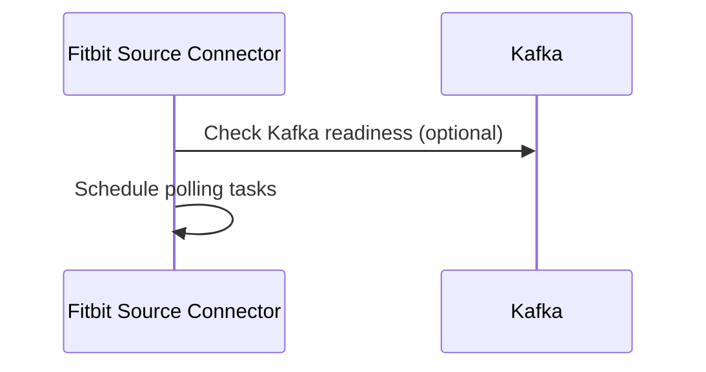
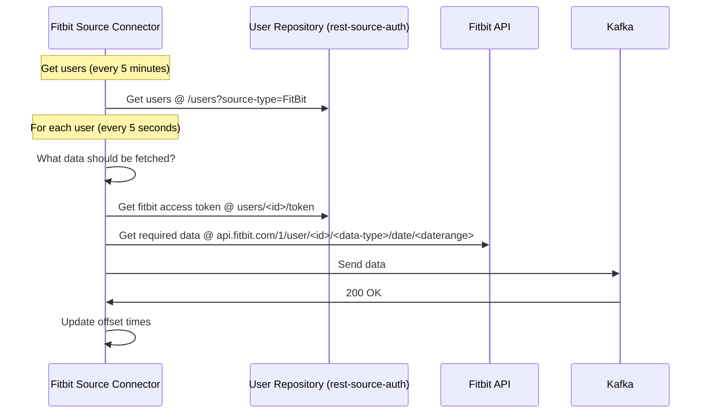

# Kafka Connect REST Source and Fitbit Source

This project contains a Kafka Connect source connector for a general REST API, for
specific Fitbit and Oura devices. The documentation of the Kafka Connect REST source still needs to
be done.

<!-- TOC -->

* [Kafka Connect REST Source and Fitbit Source](#kafka-connect-rest-source-and-fitbit-source)
  * [Fitbit source connector](#fitbit-source-connector)
    * [Installation](#installation)
    * [Usage](#usage)
  * [Sentry monitoring](#sentry-monitoring)
  * [Contributing](#contributing)

<!-- TOC -->

## Fitbit source connector

### Installation

This repository relies on a recent version of docker and docker-compose as well as an installation
of Java 17 or later.

### Usage

Generally, this component is installed
with [RADAR-Kubernetes](https://github.com/RADAR-base/RADAR-Kubernetes). It uses Docker
image [radarbase/kafka-connect-rest-fitbit-source](https://hub.docker.com/r/radarbase/kafka-connect-rest-fitbit-source).

First, [register a Fitbit App](https://dev.fitbit.com/apps) with Fitbit. It should be either a
server app, for multiple users, or a personal app for a single user. With the server app, you need
to [request access to intraday API data](https://dev.fitbit.com/build/reference/web-api/help/).

For every Fitbit user you want access to, copy `docker/fitbit-user.yml.template` to a file in
`docker/users/`. Get an access token and refresh token for the user using for example the
[Fitbit OAuth 2.0 tutorial page](https://dev.fitbit.com/apps/oauthinteractivetutorial).

For automatic configuration for multiple users, please take a look at
`scripts/REDCAP-FITBIT-AUTH-AUTO/README.md`.

Copy `docker/source-fitbit.properties.template` to `docker/source-fitbit.properties` and enter
your Fitbit App client ID and client secret. The following tables shows the possible properties.

<table class="data-table"><tbody>
<tr>
<th>Name</th>
<th>Description</th>
<th>Type</th>
<th>Default</th>
<th>Valid Values</th>
<th>Importance</th>
</tr>
<tr>
<td>application.loop.interval.ms</td><td>How often to perform the main application loop (only controls how often to poll for new user registrations).></td><td>long</td><td>300000</td><td></td><td></td></tr>
<tr>
<td>user.cache.refresh.interval.ms</td><td>How often to invalidate the cache and poll for new user registrations.</td><td>long</td><td>3600000</td><td></td><td></td></tr>
<tr>
<td>rest.source.poll.interval.ms</td><td>How often to poll the source URL.</td><td>long</td><td>60000</td><td></td><td>low</td></tr>
<tr>
<td>rest.source.base.url</td><td>Base URL for REST source connector.</td><td>string</td><td></td><td></td><td>high</td></tr>
<tr>
<td>rest.source.destination.topics</td><td>The  list of destination topics for the REST source connector.</td><td>list</td><td>""</td><td></td><td>high</td></tr>
<tr>
<td>rest.source.topic.selector</td><td>The topic selector class for REST source connector.</td><td>class</td><td>org.radarbase.connect.rest.selector.SimpleTopicSelector</td><td>Class extending org.radarbase.connect.rest.selector.TopicSelector</td><td>high</td></tr>
<tr>
<td>rest.source.payload.converter.class</td><td>Class to be used to convert messages from REST calls to SourceRecords</td><td>class</td><td>org.radarbase.connect.rest.converter.StringPayloadConverter</td><td>Class extending org.radarbase.connect.rest.converter.PayloadToSourceRecordConverter</td><td>low</td></tr>
<tr>
<td>rest.source.request.generator.class</td><td>Class to be used to generate REST requests</td><td>class</td><td>org.radarbase.connect.rest.single.SingleRequestGenerator</td><td>Class extending org.radarbase.connect.rest.request.RequestGenerator</td><td>low</td></tr>
<tr>
<td>fitbit.users</td><td>The user ID of Fitbit users to include in polling, separated by commas. Non existing user names will be ignored. If empty, all users in the user directory will be used.</td><td>list</td><td>""</td><td></td><td>high</td></tr>
<tr>
<td>fitbit.api.client</td><td>Client ID for the Fitbit API</td><td>string</td><td></td><td>non-empty string</td><td>high</td></tr>
<tr>
<td>fitbit.api.secret</td><td>Secret for the Fitbit API client set in fitbit.api.client.</td><td>password</td><td></td><td></td><td>high</td></tr>
<tr>
<td>fitbit.user.poll.interval</td><td>Polling interval per Fitbit user per request route in seconds.</td><td>int</td><td>150</td><td></td><td>medium</td></tr>
<tr>
<td>fitbit.api.intraday</td><td>Set to true if the client has permissions to Fitbit Intraday API, false otherwise.</td><td>boolean</td><td>false</td><td></td><td>medium</td></tr>
<tr>
<td>fitbit.user.repository.class</td><td>Class for managing users and authentication.</td><td>class</td><td>org.radarbase.connect.rest.fitbit.user.YamlUserRepository</td><td>Class extending org.radarbase.connect.rest.fitbit.user.UserRepository</td><td>medium</td></tr>
<tr>
<td>fitbit.user.dir</td><td>Directory containing Fitbit user information and credentials. Only used if a file-based user repository is configured.</td><td>string</td><td>/var/lib/kafka-connect-fitbit-source/users</td><td></td><td>low</td></tr>
<tr>
<td>fitbit.user.repository.url</td><td>URL for webservice containing user credentials. Only used if a webservice-based user repository is configured.</td><td>string</td><td>""</td><td></td><td>low</td></tr>
<tr>
<td>fitbit.user.repository.client.id</td><td>Client ID for connecting to the service repository.</td><td>string</td><td>""</td><td></td><td>medium</td></tr>
<tr>
<td>fitbit.user.repository.client.secret</td><td>Client secret for connecting to the service repository.</td><td>string</td><td>""</td><td></td><td>medium</td></tr>
<tr>
<td>fitbit.user.repository.oauth2.token.url</td><td>OAuth 2.0 token url for retrieving client credentials.</td><td>string</td><td>""</td><td></td><td>medium</td></tr>
<tr>
<td>fitbit.intraday.steps.topic</td><td>Topic for Fitbit intraday steps</td><td>string</td><td>connect_fitbit_intraday_steps</td><td>non-empty string without control characters</td><td>low</td></tr>
<tr>
<td>fitbit.intraday.heart.rate.topic</td><td>Topic for Fitbit intraday heart_rate</td><td>string</td><td>connect_fitbit_intraday_heart_rate</td><td>non-empty string without control characters</td><td>low</td></tr>
<tr>
<td>fitbit.sleep.stages.topic</td><td>Topic for Fitbit sleep stages</td><td>string</td><td>connect_fitbit_sleep_stages</td><td>non-empty string without control characters</td><td>low</td></tr>
<tr>
<td>fitbit.sleep.classic.topic</td><td>Topic for Fitbit sleep classic data</td><td>string</td><td>connect_fitbit_sleep_classic</td><td>non-empty string without control characters</td><td>low</td></tr>
<tr>
<td>fitbit.time.zone.topic</td><td>Topic for Fitbit profile time zone</td><td>string</td><td>connect_fitbit_time_zone</td><td>non-empty string without control characters</td><td>low</td></tr>
<tr>
<td>fitbit.activity.log.topic</td><td>Topic for Fitbit activity log.</td><td>string</td><td>connect_fitbit_activity_log</td><td>non-empty string without control characters</td><td>low</td></tr>
<tr>
<td>fitbit.intraday.calories.topic</td><td>Topic for Fitbit intraday calories</td><td>string</td><td>connect_fitbit_intraday_calories</td><td>non-empty string without control characters</td><td>low</td></tr>
<tr>
<td>fitbit.user.firebase.collection.fitbit.name</td><td>Firestore Collection for retrieving Fitbit Auth details. Only used when a Firebase based user repository is used.</td><td>string</td><td>fitbit</td><td></td><td>low</td></tr>
<tr>
<td>fitbit.user.firebase.collection.user.name</td><td>Firestore Collection for retrieving User details. Only used when a Firebase based user repository is used.</td><td>string</td><td>users</td><td></td><td>low</td></tr>
</tbody></table>

If the ManagementPortal is used to authenticate against the user repository, please add an OAuth
client to ManagementPortal with the following properties:

```
Client ID: fitbit.user.repository.client.id
Client Secret: fitbit.user.repository.client.secret
Scope: SUBJECT.READ MEASUREMENT.CREATE
Resources: res_restAuthorizer
Grant types: client_credentials
Access Token validity: 600
Refresh Token validity: 0
```

Finally set the `fitbit.user.repository.oauth.token.url` to
`http://managementportal-app:8080/managementportal/oauth/token`.

Now you can run a full Kafka stack using

```shell
docker-compose up -d --build
```

Inspect the progress with `docker-compose logs -f radar-fitbit-connector`. To inspect data
that is coming out of the requests, run

```shell
docker-compose exec schema-registry-1 kafka-avro-console-consumer \
  --bootstrap-server kafka-1:9092,kafka-2:9092,kafka-3:9092 \
  --from-beginning \
  --topic connect_fitbit_intraday_heart_rate
```

## Flows

The following diagrams shows the flow of the Fitbit source connector. The fitbit source connector is a Kafka Connect source connector that polls the Fitbit API for data. The data is then converted to Avro records and sent to Kafka topics.

### Initialization

On startup, the fitbit connector simply starts up and schedules its regular polling tasks.



### Regular operation

The Fitbit connector operates by regularly polling the user repository, and regularly polling all configured users for data



## Sentry monitoring

To enable Sentry monitoring for the generic REST, Fitbit, or Oura source connector service:

1. Set a `SENTRY_DSN` environment variable that points to the desired Sentry DSN.
2. (Optional) Set the `SENTRY_LOG_LEVEL` environment variable to control the minimum log level of
   events sent to Sentry.
   The default log level for Sentry is `ERROR`. Possible values are `TRACE`, `DEBUG`, `INFO`, `WARN`,
   and `ERROR`.

For further configuration of Sentry via environmental variables see [here](https://docs.sentry.io/platforms/java/configuration/#configuration-via-the-runtime-environment). For instance:

```
SENTRY_LOG_LEVEL: 'ERROR'
SENTRY_DSN: 'https://000000000000.ingest.de.sentry.io/000000000000'
SENTRY_ATTACHSTACKTRACE: true
SENTRY_STACKTRACE_APP_PACKAGES: io.confluent.connect,org.radarbase.connect.rest
```

## Contributing

Code should be formatted using
the [Google Java Code Style Guide](https://google.github.io/styleguide/javaguide.html).
If you want to contribute a feature or fix browse
our [issues](https://github.com/RADAR-base/RADAR-REST-Connector/issues), and please make a pull
request.
